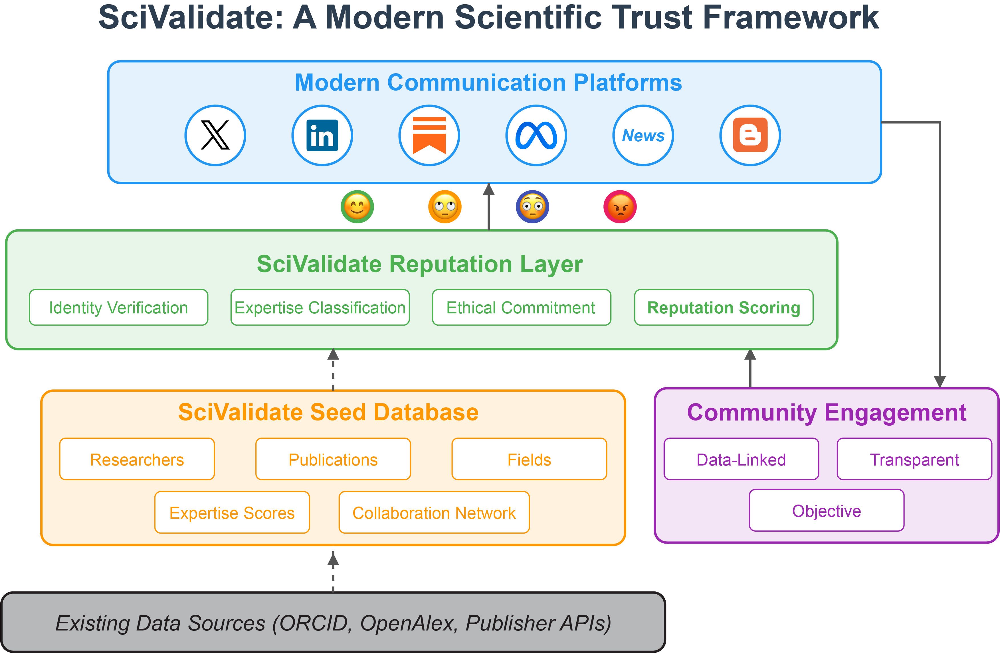

# SciValidate

## Scientific Validation Architecture for the Modern Age

SciValidate is a proposed system for authenticating scientific expertise and verifying scientific claims across communication platforms. This project aims to create a trust framework that maintains scientific rigor in online discourse while adapting to contemporary communication patterns.

> **Note:** SciValidate is currently in the prototype/proof-of-concept stage. The code in this repository represents early exploratory work and is shared to encourage collaboration and feedback.

## The Challenge

Scientific communication today faces multiple critical challenges:

1. **Trust crisis:** Public trust in scientific institutions and expertise is eroding
2. **Information overload:** Research publication volume is overwhelming traditional peer review
3. **Platform fragmentation:** Scientific discourse is scattered across platforms that weren't designed for it
4. **Paper mills and fraud:** Organized production of fraudulent research threatens the integrity of scientific literature
5. **Inadequate feedback mechanisms:** Binary like/dislike systems don't capture the nuance of scientific agreement

SciValidate proposes a solution that allows verified scientific expertise to flow across platforms while maintaining rigor and accessibility.

## Project Vision

SciValidate seeks to create:

1. A **verification system** that authenticates scientific expertise through public credentials
2. A **reputation network** that tracks verified accomplishments while respecting domain specificity
3. A **cross-platform identity layer** that allows consistent verification of identity and claims
4. An **evidence framework** for linking concise social media posts to their full scientific foundation
5. A **visual indication system** that makes the state of scientific consensus instantly understandable



## Current State of Development

The current repository contains:

1. **Data collection tools**: Scripts for gathering faculty information and publication data
2. **Database infrastructure**: Systems for storing researcher profiles, publications, and expertise metrics
3. **Analysis components**: Tools for identifying research networks and expertise domains
4. **Expertise classification**: Methods for determining field-specific expertise scores

Our development so far has focused on creating a small-scale prototype working with a single academic department (RPI Chemistry) to test core concepts.

## Code Organization

The repository is organized as follows:

```
scivalidate/
├── src/                    # Source code
│   ├── data_collection/    # Faculty and researcher data acquisition
│   │   ├── scraper.py      # Web scraping implementation for academic departments
│   │   └── faculty_data_emails.json  # Structured faculty information
│   │
│   ├── database/           # Data persistence and modeling
│   │   └── database_populator_4.py  # Database schema and population logic
│   │
│   ├── analysis/           # Scientific expertise analysis
│       ├── process_faculty.py  # Processing pipeline for faculty data
│       ├── author_analyzer.py  # Expertise calculation and network analysis
│       ├── author_analysis_config.json  # Analysis configuration
│       ├── scivalidate.db  # SQLite database with processed data
│       └── network_cache/  # Cache for network analysis results
│
├── docs/                   # Project documentation
│   ├── overview.md         # Project vision and architecture
│   ├── challenges.md       # Technical challenges and approaches
│   ├── api_documentation.md # API design specifications
│   ├── database_schema.md  # Database schema reference
│   └── getting_started.md  # Guide for new contributors
│
├── tests/                  # Test suite
│   └── test_name_parsing.py # Unit tests for name parsing functionality
│
├── web/                    # Future web interface components
│   └── placeholder.html    # Placeholder for web implementation
│
├── CONTRIBUTING.md         # Contribution guidelines
├── README.md               # Project overview
├── LICENSE                 # MIT License
└── requirements.txt        # Python dependencies
```

## Key Challenges

We're actively seeking collaborators to help address several significant challenges:

### 1. Network Scale and Seeding

Starting with the RPI Chemistry Department (32 faculty) identified 15 with both ORCID identifiers and substantial publication records, with connections to over 3,000 coauthors. Creating a comprehensive "tree of expertise" that identifies the top field experts in each domain requires both technical solutions and academic outreach.

### 2. Platform Integration

The verification system must work across platforms where scientific discourse happens. Most major platforms (Twitter/X, LinkedIn, etc.) are proprietary with limited API access. We need innovative approaches to create a verification layer that works universally without requiring direct platform integration.

### 3. Critical Mass and Network Effects

Achieving sufficient adoption requires demonstrating immediate value to early users. We need strategies for overcoming the initial adoption barriers, potentially through institutional partnerships or focused scholarly communities.

### 4. Reputation Measurement

Designing a system to evaluate scientific reputation that balances traditional metrics (citations, h-index) with domain-specific considerations and resists gaming or manipulation remains a complex challenge.

## Getting Started

### Prerequisites

- Python 3.8+
- SQLite3
- Required Python packages listed in `requirements.txt`

### Installation

1. Clone the repository:

```bash
git clone https://github.com/yourusername/scivalidate.git
cd scivalidate
```

2. Install required packages:

```bash
pip install -r requirements.txt
```

3. Run the data scraper to collect faculty information:

```bash
python src/data_collection/scraper.py
```

4. Process faculty data to populate the database:

```bash
python src/database/process_faculty.py
```

5. Analyze author expertise:

```bash
python src/analysis/author_analyzer.py --db scivalidate.db
```

## How to Contribute

We welcome contributions in several areas:

1. **Code Development**: Improving existing systems or adding new components
2. **Documentation**: Enhancing explanations and user guides
3. **Testing**: Developing robust test cases and validation procedures
4. **Use Cases**: Suggesting and developing specific applications
5. **Outreach**: Helping connect with scientific communities for testing and feedback

To contribute:

1. Fork the repository
2. Create a new branch (`git checkout -b feature/your-feature`)
3. Make your changes
4. Commit your changes (`git commit -m 'Add some feature'`)
5. Push to the branch (`git push origin feature/your-feature`)
6. Open a Pull Request

## Background Reading

For more context on the SciValidate concept, see these articles:

- [Beyond DeSci: A Modern Architecture for Scientific Trust](https://open.substack.com/pub/healingearth/p/beyond-desci-a-modern-architecture)
- [Beyond DeSci Part 2: Starting Small](https://open.substack.com/pub/healingearth/p/beyond-desci-part-2-starting-small)

## License

This project is licensed under the MIT License - see the LICENSE file for details.

## Contact

If you're interested in collaborating or have questions, please reach out to [your-contact-information].

## Acknowledgments

Thanks to the faculty and staff of the Rensselaer Polytechnic Institute Department of Chemistry and Chemical Biology for their participation in early testing and feedback.
